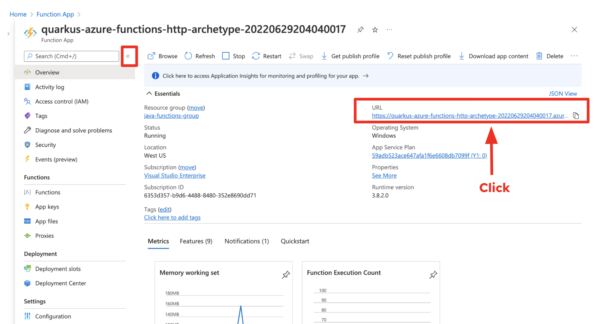
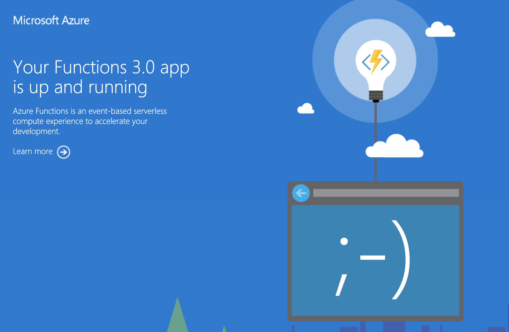

# Tutorial: Bring Serverless Java Apps with Quarkus into Azure Function

This tutorial walks you through the process of developing, building, and deploying serverless Java apps with Quarkus on Azure Function. 
When you are finished, you will run serverless [Quarkus](https://quarkus.io) applications on [Azure Functions](https://azure.microsoft.com/en-us/services/functions/) as well as continuing to monitor the applications on Azure.


In this tutorial, you learn how to:

> [!div class="checklist"]
> * Create a Serverless Function project on Quarkus
> * Make a Portable Serverless Functions with Quarkus Funqy
> * Test the Serverless Function locally
> * Deploy the Serverless App to Azure Function
> * Access and Monitor the Serverless Function on Azure
[!INCLUDE [quickstarts-free-trial-note](../../includes/quickstarts-free-trial-note.md)]

## Prerequisites

* [Azure CLI](/cli/azure/overview), installed on your own computer. 
* [An Azure Account](https://azure.microsoft.com/)
* [Java JDK 11+](/azure/developer/java/fundamentals/java-support-on-azure) with JAVA_HOME configured appropriately
* [Apache Maven 3.8.1+](https://maven.apache.org)

## Create a Serverless Function project on Quarkus

1. Create the Azure Maven project for your Quarkus application using our Maven Archetype. Run the following `Maven` command on your local terminal.

    ```bash
    mvn archetype:generate \
        -DarchetypeGroupId=io.quarkus \
        -DarchetypeArtifactId=quarkus-azure-functions-http-archetype \
        -DgroupId=org.acme \
        -DartifactId=quarkus-azure-function \
        -DarchetypeVersion=2.12.0.Final
    ```

    The output should end up with `BUILD SUCCES`.

    ```output
    ...
    [INFO] Parameter: function, Value: quarkus
    [INFO] Parameter: artifactId, Value: quarkus-azure-function
    [INFO] Parameter: appRegion, Value: westus
    [INFO] Parameter: version, Value: 1.0-SNAPSHOT
    [INFO] Project created from Archetype in dir: /Users/danieloh/Downloads/demo/quarkus-azure-function
    [INFO] ------------------------------------------------------------------------
    [INFO] BUILD SUCCESS
    [INFO] ------------------------------------------------------------------------
    ...
    ```

2. Open the `quarkus-azure-function` project using your preferred Integrated development environment (IDE) tool (e.g. _Visual Studio Code_).

    Templates for Azure Functions deployment descriptors (`host.json`, `function.json`) are generated in the `azure-config` directory. 

    * `function.json` - Define the function information such as entryPoint, bindings method (e.g. _GET_, _POST_), and protocol type (e.g. _http_)
    * `host.json` - Define the function host version (e.g. _2.0_)
    * `local.settings.json` - Set the encryption and function worker runtime (e.g. _java_)
    
## Make a Portable Serverless Functions with Quarkus Funqy

1. Remove the unused extensions because you will use *Quarkus Funqy* extension in this tutorial because the generated sample project includes the *RESTEasy Reactive*, *Undertow*, *Reactive Routes*, and *Funqy HTTP* extensions. 

    `Quarkus Funqy` aims to provide a portable _Java API_ for developers to write serverless functions deployable to multiple serverless platforms such as _AWS Lambda_, _Azure Functions_, _Google Cloud Functions_, and _Knative on Kubernetes_. Because Funqy is an abstraction to span multiple different cloud providers and protocols it has to be a very simple API and thus, might not have all the features you are used to in other remote abstractions.

    Move to the working directory where you generated the project. Run the following commands on your local terminal.

    ```bash
    cd quarkus-azure-function

    mvn quarkus:remove-extension -Dextensions="quarkus-resteasy,quarkus-undertow,quarkus-reactive-routes"
    ```

    > [!IMPORTANT]
    > You must include the `quarkus-azure-functions-http` extension as this is a generic bridge between the *Azure Functions runtime* and the *HTTP* framework you are writing your microservices in.

    Make sure if the following `funqy-http` and `azure-functions-http` extensions (_Maven dependencies_) exist in the `pom.xml`.

    ```xml
    <dependency>
      <groupId>io.quarkus</groupId>
      <artifactId>quarkus-funqy-http</artifactId>
    </dependency>
    <dependency>
      <groupId>io.quarkus</groupId>
      <artifactId>quarkus-azure-functions-http</artifactId>
    </dependency>
    ```

2. Delete the unused resources to process the functions because you have already removed the unused extensions.

    * `GreetingResource.java` - JAX-RS processing
    * `GreetingServlet.java` - UnderTow Servlet processing
    * `GreetingVertx.java` - Vert.x Reactive processing

    Run the following command on your local terminal.

    ```bash
    rm -rf src/main/java/io/quarkus/GreetingResource.java src/main/java/io/quarkus/GreetingServlet.java src/main/java/io/quarkus/GreetingVertx.java
    ```

3. Explore the function what it looks like. Open the `GreetingFunction.java` file in the *src/main/java/io/quarkus* directory.

    The Funqy API is dead simple. The `@Funq` annotation makes your method (e.g. _funqyHello_) a serverless function. 
    
    The function's name is same as the method's name by default. You can also define the function name using an input parameter (e.g. _funqyHello("myfunction")_).

    ```java
    @Funq
    public String funqyHello() {
        return "hello funqy";
    }
    ```

## Test the Serverless Function locally

1. Run the following _Maven_ command to run `Quarkus Dev mode` on your local terminal that enable live reload with background compilation, which means that when you modify your Java files and/or your resource files and refresh your browser, these changes will automatically take effect. This works too for resource files like the configuration property file. 

    Refreshing the browser triggers a scan of the workspace, and if any changes are detected, the Java files are recompiled and the application is redeployed; your request is then serviced by the redeployed application. If there are any issues with compilation or deployment an error page will let you know.

    This will also listen for a debugger on port `5005`. If you want to wait for the debugger to attach before running you can pass `-Dsuspend` on the command line. If you don’t want the debugger at all you can use `-Ddebug=false`.

    ```bash
    mvn quarkus:dev
    ```

    The output should should look like this.

    ```output
    ...
    --/ __ \/ / / / _ | / _ \/ //_/ / / / __/ 
    -/ /_/ / /_/ / __ |/ , _/ ,< / /_/ /\ \   
    --\___\_\____/_/ |_/_/|_/_/|_|\____/___/   
    INFO  [io.quarkus] (Quarkus Main Thread) quarkus-azure-function 1.0-SNAPSHOT on JVM (powered by Quarkus xx.xx.xx.) started in 1.290s. Listening on: http://localhost:8080

    INFO  [io.quarkus] (Quarkus Main Thread) Profile dev activated. Live Coding activated.
    INFO  [io.quarkus] (Quarkus Main Thread) Installed features: [cdi, funqy-http, smallrye-context-propagation, vertx]

    --
    Tests paused
    Press [r] to resume testing, [o] Toggle test output, [:] for the terminal, [h] for more options>
    ```

2. Access the function using the `CURL` command on your local terminal.

    ```bash
    curl localhost:8080/api/funqyHello
    ```

    The output should should look like this.

    ```output
    "hello funqy"
    ```

3. Add a new function using dependency injection (DI). Quarkus DI solution is based on the [Contexts and Dependency Injection for Java 2.0 specification](http://docs.jboss.org/cdi/spec/2.0/cdi-spec.html).

    Create a `GreetingService.java` file in the *src/main/java/io/quarkus* directory. Replace the below code into the class.

    ```java
    package io.quarkus;

    import javax.enterprise.context.ApplicationScoped;

    @ApplicationScoped
    public class GreetingService {

        public String greeting(String name) {
            return "Welcome to build Serverless Java with Quarkus into Azure Function, " + name;
        }
        
    }
    ```

    Save the file.

    This is an injectable bean that implements a `greeting()` method returning a string _"Welcome..."_ message with a parameter (_name_).


4. Open the existing `GreetingFunction.java` file in the *src/main/java/io/quarkus* directory. Replace the class with the below code to add a new field (*gService*) and method (*greeting*).

    ```java
    package io.quarkus;

    import javax.inject.Inject;
    import io.quarkus.funqy.Funq;

    public class GreetingFunction {

        @Inject
        GreetingService gService;

        @Funq
        public String greeting(String name) {
            return gService.greeting(name);
        }

        @Funq
        public String funqyHello() {
            return "hello funqy";
        }

    }
    ```

    Save the file.

5. Access the new function (*greeting*) using the `CURL` command on your local terminal.

    ```bash
    curl -d '"Dan"' -X POST localhost:8080/api/greeting
    ```

    The output should should look like this.

    ```output
    "Welcome to build Serverless Java with Quarkus into Azure Function, Dan"
    ```

    > [!IMPORTANT]
    > `Live Coding` (also referred to as dev mode) allows you to run the app and make changes on the fly. Quarkus will automatically re-compile and reload the app when changes are made. This is a powerful and efficient style of developing that you will use throughout the tutorial.

    Before moving forward to the next step, stop the _Quarkus Dev Mode_ by pressing `CTRL-C`.

## Deploy the Serverless App to Azure Function

1. Login to your Azure CLI, and optionally set your subscription if you have more than one connected to your login credentials.

    ```azurecli
    az login
    ```

    A web browser has been opened at https://login.microsoftonline.com/organizations/oauth2/v2.0/authorize automatically.

    > [!IMPORTANT]
    > Continue the login in the web browser. If no web browser is available or if the web browser fails to open, use device code flow with `az login --use-device-code`.

    Once you logged in the Azure portal successfully, the output on your local terminal should look like this.

    ```output
    xxxxxxx-xxxxx-xxxx-xxxxx-xxxxxxxxx 'Microsoft'
    [
        {
            "cloudName": "AzureCloud",
            "homeTenantId": "xxxxxx-xxxx-xxxx-xxxx-xxxxxxx",
            "id": "xxxxxx-xxxx-xxxx-xxxx-xxxxxxxx",
            "isDefault": true,
            "managedByTenants": [],
            "name": "Visual Studio Enterprise",
            "state": "Enabled",
            "tenantId": "xxxxxxx-xxxx-xxxx-xxxxx-xxxxxxxxxx",
            "user": {
            "name": "doh@redhat.com",
            "type": "user"
            }
        },
        {
            "cloudName": "AzureCloud",
            "homeTenantId": "xxxxxxx-xxxx-xxxx-xxxxx-xxxxxxxxxx",
            "id": xxxxxxx-xxxx-xxxx-xxxxx-xxxxxxxxxx",
            "isDefault": false,
            "managedByTenants": [],
            "name": "Visual Studio Enterprise",
            "state": "Enabled",
            "tenantId": "xxxxxxx-xxxx-xxxx-xxxxx-xxxxxxxxxx",
            "user": {
            "name": "doh@redhat.com",
            "type": "user"
            }
        }
    ]
    ```

2. Build and deploy the functions to Azure

    The `pom.xml` you generated in the previous step pulls in the `azure-functions-maven-plugin`. Running maven install generates config files and a staging directory required by the `azure-functions-maven-plugin`. Run the following `Maven` command on your local terminal.

    ```bash
    mvn clean install -DskipTests azure-functions:deploy
    ```

    The output should end up with `BUILD SUCCESS`. 

    ```output
    Successfully deployed the artifact to https://quarkus-demo-123451234.azurewebsites.net
    ```

    You can also find the `URL` to trigger your function on Azure in the output log.

    ```output
    [INFO] HTTP Trigger Urls:
    [INFO] 	 quarkus : https://quarkus-azure-functions-http-archetype-20220629204040017.azurewebsites.net/api/{*path}
    ```

## Access and Monitor the Serverless Function on Azure
    
1. Go to `Function App` in the Azure portal. You will see the deployed Quarkus function (e.g. _quarkus-azure-functions-http-archetype-20220629204040017_).

    

    When you click on the `function name`, you will see the function app's detail information such as *Location*, *Subscription*, *URL*, *Metrics*, and *App Service Plan*.

2. In the detail page, click on the `URL`.

    

    Then, you will see if your function is `up` and `running` now. 

    

3. Invoke the `greeting` function using `CURL` command on your local terminal.

    > [!IMPORTANT]
    > Replace `YOUR_HTTP_TRIGGER_URL` with your own function URL that you find in Azure portal or output.

    ```bash
    curl -d '"Dan on Azure"' -X POST https://YOUR_HTTP_TRIGGER_URL/api/greeting
    ```

    The output should look like this.

    ```output
    "Welcome to build Serverless Java with Quarkus into Azure Function, Dan on Azure"
    ```

    You can also access the other function (`funqyHello`).

    ```bash
    curl https://YOUR_HTTP_TRIGGER_URL/api/funqyHello
    ```

    The output should be the same as you've got locally.

    ```output
    "hello funqy"
    ```

## Clean up resources

If you don't need these resources for another tutorial (see [Next steps](#next)), you can delete them by running the following command in the Cloud Shell or on your local terminal:

```azurecli
az group delete --name java-functions-group --yes
```

<a name="next"></a>

## Next steps

[Azure for Java Developers](/java/azure/)
[Quarkus](https://quarkus.io), 
[Getting Started with Quarkus](https://quarkus.io/get-started/), and
[App Service Linux](overview.md).

Learn more about running Java apps on App Service on Linux in the developer guide.

> [!div class="nextstepaction"] 
> [Java in App Service Linux dev guide](configure-language-java.md?pivots=platform-linux)
